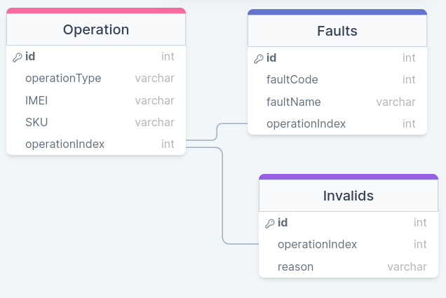

For this assessment, the challenge for me was to turn the semi-unstructured data from the txt file into structured data capable of being uploaded to a database.

My approach was to read the file into a list of strings and then use a nested for loop to a) find each operation of a device coming to or leaving the facility and b) to add all of the faults associated with that operation to it.

Once the data was in a dictionary, it was pretty simple to answer the prompts. It was just a matter of looping through the dictionary keeping track of the count, the invalid records, and the fault key.

For the SQL schema:

I opted to go for three seperate tables.

One for each operation in the data, detailing its Operation Type (SEND or RECV), the EMEI, the SKU, and its index.

The fault table containes the code, the name of the fault, and the operation index where it occured as a Foreign Key.

The Invalids is a list of the operations with their index, again as a foreign key, and reason for failing.